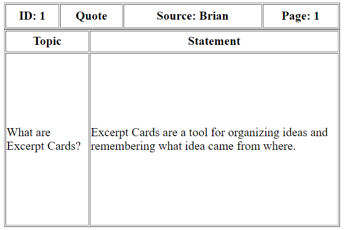

# IdeaStackr: A framework for organizing and structuring information

## Steps of the IdeaStackr framework

### 1. Data collection

Collect raw information in this CSV format:

```csv
idNum;infoType;source;page;topic;statement
1;o;a great book;22;Excerpt Cards;Excerpt Cards are a great way to keep track of ideas by recording source and info type for each thought you have while gathering information.
2;q;Brian;23;Cards can be declared as 'q', 'o' or 'p'.;Declaring info type can be useful for citing works later. Q is for quote, O for my opinion, and P for paraphrase.
3;p;The Bible;456;Paraphrase example;Treat others like you want to be treated.
```
- Fields:

  - `idNum`: unique index number for card
  - `infoType`: "q" for quote, "p" for paraphrase, or "o" for personal opinion
  - `source`: unique name/nickname you have source details saved under (wherever)
  - `page`: page number in source (0 for without pages i.e. website)
  - `topic`: brief summary of idea
  - `statement`: the idea itself
  
- Caveat: do not use ";" (semicolons) in your data. Substitute them with some other symbol.

### 2. Card generation

- Create idea card jpegs with [`csv2card.py`](csv2card.py)
  - First, install [`imgkit`](https://pypi.org/project/imgkit/):
    - `pip install imgkit`
  - Also, you need to install [`wkhtmltopdf`](https://wkhtmltopdf.org/index.html), which is a dependency for [`imgkit`](https://pypi.org/project/imgkit/)
    - Get it [here](https://wkhtmltopdf.org/downloads.html)
  - Sample output:
    
      
      
- Use your printer to make paper cards from the images (A6 format works best).

### 3. Card clustering

- Create a coordinate system on your desk with 1, 2, 3, 4 on one axis and A, B, C, D, E on the other. Make it big enough to put one note card in each cell.
- Cluster like note cards to like note cards. Once two or three cards are in one stack, name the stack. Write down its name on this chart:

  [](categoryTable.pdf)

- **Rename stacks as often as you like!** The point is to have an appropriate name at the end. You may also want to merge or split stacks as you go.
- When you are finished, you have stacks that represent the low-level structure of your information, like this:

  

### 4. Stack clustering

- Once you have a set of named stacks on your table, label each stack with a post-it according to your names in the [chart](categoryTable.png).
- Now we're going to cluster the clusters to create a structure for our research!
- Repeat step 3. with a blank [chart](categoryTable.png), this time clustering stacks instead of individual cards and naming these superstacks instead of the stacks.


### 5. Sequentialization

- For each superstack, put its stacks in a logical order. The resulting sequence represents the high-level structure of the information you collected. 
- Optional: For each stack, put its cards in a logical order. This is your low-level structure.
- You should now have one big heap of cards containing ordered superstacks which contain ordered stacks which contain individual cards.
- This is your table of contents!

### 6. Composing

- The final step of the framework is to weave your superstacks, stacks and cards into a new composition. 
- Put the heap of ordered stacks and superstacks on your desk, and integrate the cards' contents one by one.


## Background: Excerpting

The system behind IdeaStackr is called excerpting (German: *Exzerpieren*)

[][1]

- [Definition: Exzerpieren](https://www.uni-erfurt.de/seminarfach/kurs/9/#c67025), Uni Erfurt
- [Leitfaden zur Erstellung eines Exzerpts](https://www.uni-bielefeld.de/erziehungswissenschaft//scs/pdf/leitfaeden/studierende/exzerpt.pdf), Uni Bielefeld
<!-- - [How do I excerpt?](https://www.uni-kassel.de/uni/index.php?eID=dumpFile&t=f&f=907&token=57252036805e1227831a802f377dde1c13925dbc), Uni Kassel -->
<!-- - [Exzerpieren](https://www.europa-uni.de/de/struktur/zsfl/institutionen/schreibzentrum/angebote/lehrende/materialien/Exzerpieren.pdf), Europa-Uni Frankfurt (Oder)
- [Leitfaden: Ein Exzerpt erstllen](https://mentoren.philol.uni-leipzig.de/fileadmin/mentoren.philol.uni-leipzig.de/uploads/dokumente/Leitfaden_Exzerpt_01.pdf), Uni Leipzig -->

[1]:https://www.uni-erfurt.de/seminarfach/kurs/9/#c67025
